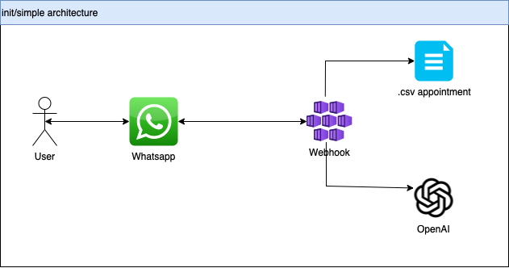

## **Chatbot Assistant - Appointment**




### **Prerequisites :**
1. **Set up Open AI key and additional resource in .env files.**
   - Fill out all the necessary key.
2. **Set up Whatsapp Integration key and additional resource in .env files.**
   - Fill out all the necessary key.


### **Create conda env :**

```bash
conda create --n gpt-chatbot python=3.11
```

### **Activate env :**

```bash
conda activate gpt-chatbot
```

### **Install All Depedencies :**

```bash
pip install -r requirements.txt
```

### **Run Local :**

```bash
make run
```

### **Run Docker :**

```bash
make build
```